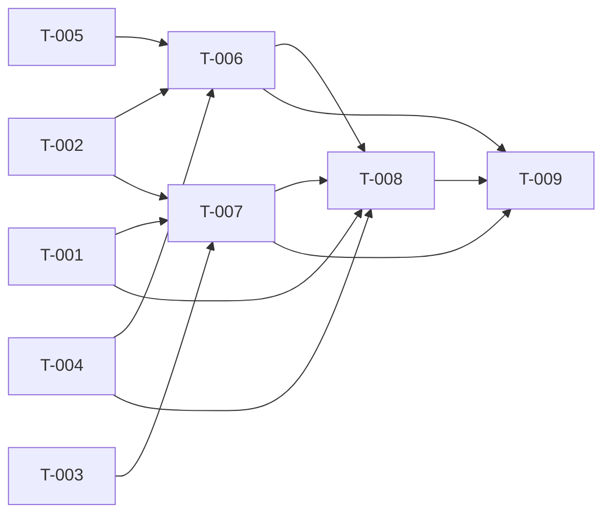

# Build Site

Build site for `context/kits/cavekit-vram-lease-client.md` (self.speak's side of
the cross-service VRAM-lease protocol brokered by core / `selfai/self.ai`). Scope:
2 requirements (R1 VRAM State Reporting, R2 Release-Request Handling), **14
acceptance criteria** (R1: 6, R2: 8). The capability lives entirely in the Python
`api/src/` layer of a **single uvicorn process**; there is no C++ router and no
supervisord split (the two divergences from the self.llamolotl sibling that this
build site is patterned on). All GPU introspection is via `torch.cuda`; all
single-flight and drain-wait synchronisation is in-process (asyncio primitives).

Both endpoints are the **authoritative wire contract** the core-side transport
parses. Field names, status vocabulary, and the null-vs-0 / int-not-bool rules
below were verified against the staged core references
(`vram-refs/core-transport-vram_llamolotl.py`,
`vram-refs/core-broker-protocol.py`, `vram-refs/llamolotl-endpoints.py`) and are
NOT free to drift:

- **R1 vram-state:** `held_vram_bytes`, `total_capacity_bytes`, in **bytes**;
  real ints when probed, JSON **`null`** (not 0) when GPU-present-but-unprobable,
  integer **`0`** when no-CUDA/CPU.
- **R2 release request:** `{"target_bytes": int, "timeout_seconds": float}` —
  amount-based only, no mechanism field.
- **R2 release reply:** `{"status": <str>, "freed_bytes": <int>}`. Core's
  `_map_response` (vram_llamolotl.py:184-263) treats `status` ∈
  `{released, partial, confirmed}` **AND** `isinstance(freed, int) and not
  isinstance(freed, bool)` as a confirmed release; **HTTP 409 or in-band
  `status == "busy"`** → treated as TIMEOUT/"not now" (never a denial); anything
  else → TIMEOUT. A boolean `freed_bytes` is explicitly rejected. These are hard
  constraints on T-004/T-006/T-008.

## Decisions baked in (from the kit's `## Decisions` — FINAL, not re-opened)

- **Release mechanism = wait-then-free within the timeout** (R2). On a release,
  wait — bounded by `timeout_seconds` — for in-flight synthesis to drain, then
  `ModelManager.unload_all()` → `KokoroV1.unload()` (drops model, clears
  pipelines, `torch.cuda.empty_cache()` + `synchronize()`) and confirm the
  live-measured freed amount. Deadline hit while still generating → truthful
  `partial` (typically `freed_bytes: 0`); never yank the model from under an
  active `POST /v1/audio/speech`.
- **Scope names = `system:read` / `system:write`** (R1/R2), reusing llamolotl's
  exact names. Both are NEW to self.speak (whose taxonomy held only
  `audio:synthesize`).

## Tier 0 — No Dependencies (Start Here)

| Task | Title | Cavekit Requirement | blockedBy | Effort |
|------|-------|---------------------|-----------|--------|
| T-001 | Add `system:read` + `system:write` to the auth.py scope taxonomy | R1, R2 | none | S |
| T-002 | Live `torch.cuda` VRAM probe (tri-state, never cached) | R1 | none | M |
| T-003 | R1 `VramStateResponse` wire model (bytes, null-vs-0) | R1 | none | S |
| T-004 | R2 `VramReleaseRequest` / `VramReleaseResponse` models (int-not-bool) | R2 | none | S |
| T-005 | In-flight-synthesis counter + bounded wait-for-drain | R2 | none | M |

## Tier 1 — Depends on Tier 0

| Task | Title | Cavekit Requirement | blockedBy | Effort |
|------|-------|---------------------|-----------|--------|
| T-006 | Release orchestration: single-flight, drain-wait, live-verified, CPU no-op | R2 | T-002, T-004, T-005 | M |
| T-007 | `GET /api/system/vram-state` endpoint + new `system` router + registration | R1 | T-001, T-002, T-003 | S |

## Tier 2 — Depends on Tier 1

| Task | Title | Cavekit Requirement | blockedBy | Effort |
|------|-------|---------------------|-----------|--------|
| T-008 | `POST /api/system/vram-release` endpoint (`system:write`, 409-on-busy) | R2 | T-001, T-004, T-006, T-007 | S |

## Tier 3 — Depends on Tier 2

| Task | Title | Cavekit Requirement | blockedBy | Effort |
|------|-------|---------------------|-----------|--------|
| T-009 | `test_vram_lease.py` — every AC, keeps `test:pytest` green | R1, R2 | T-006, T-007, T-008 | L |

---

## Task Detail

### T-001: Add `system:read` + `system:write` to the auth.py scope taxonomy
**Cavekit Requirement:** R1, R2
**Acceptance Criteria Mapped:** R1-AC1 (endpoint gated by `system:read` — the scope must exist for self.speak), R2-AC1 (endpoint gated by `system:write`)
**blockedBy:** none
**Effort:** S
**Description:** Add the two new scopes to `api/src/core/auth.py`. Note the honest
shape of this repo's "taxonomy": `require_scope(required_scope: str)` does a plain
membership check of `required_scope` against the ticket's granted scopes
(auth.py:106-134) — there is **no enum or allow-list constant to extend**. The
taxonomy is documented only in the module docstring (auth.py:24-33, currently
listing `audio:synthesize` alone). So this task is:
1. Extend the docstring scope-taxonomy block to add:
   `system:read  - GET /api/system/vram-state` and
   `system:write - POST /api/system/vram-release`, mirroring llamolotl's names.
2. (Recommended, optional) introduce module-level constants
   `SCOPE_SYSTEM_READ = "system:read"` / `SCOPE_SYSTEM_WRITE = "system:write"`
   (and keep `SCOPE_AUDIO_SYNTHESIZE = "audio:synthesize"`) so T-007/T-008 route
   decorators reference a named constant rather than a bare string — reduces
   typo-drift against the wire scope core mints.
The docstring already says "keep both lists in sync" with self.ai's minting side
(`api/selfai_ui/utils/service_auth.py`); reinforce that note for the two new
scopes.
**Files:** `api/src/core/auth.py`
**Cross-repo handoff (NOT built here):** core (`selfai/self.ai`) must add audience
`self.speak` to the `system:read` / `system:write` scopes on its **minting** side
(`api/selfai_ui/utils/service_auth.py`) — core already mints this pair for the
`self.llamolotl` audience (per `vram_llamolotl.py:70-73`), so this is an audience
addition, not a new scope. The scope **string** here must match byte-for-byte what
core mints. This is an explicit two-sided coordination.
**Test Strategy:** Covered in T-009 — mint a ticket with `scope="system:read"`
(and `"system:write"`) via `mint_test_ticket(scope=...)` and assert the guarded
routes are NOT rejected (401/403); mint with a wrong scope and assert 403. Mirrors
`test_ticket_auth.py`'s `TestScopeEnforcement`.

### T-002: Live `torch.cuda` VRAM probe (tri-state, never cached)
**Cavekit Requirement:** R1
**Acceptance Criteria Mapped:** R1-AC2 (computed live per request, never cached), R1-AC4 (three-state distinction), R1-AC5 (unreachable/unknown NEVER coerced to 0). Also the freed-amount measurement primitive reused by T-006 (R2-AC3).
**blockedBy:** none
**Effort:** M
**Description:** Create a new module `api/src/inference/vram_lease.py` (the
`/api/system/*` capability's home — this repo has no `state.py` analogue to
llamolotl's) and add `probe_vram_state() -> dict`. It computes, **live on every
call** (no caching, no stored figure), the three-state answer via `torch.cuda`,
honouring the exact tri-state the kit's R1-AC4 requires:
- **(a) GPU reachable & probed** → `torch.cuda.is_available()` is True AND both
  `torch.cuda.mem_get_info()` (returns `(free, total)` in bytes → `total` is
  `total_capacity_bytes`) and `torch.cuda.memory_allocated()` (→ `held_vram_bytes`)
  succeed. Both fields are **real ints** (held near-zero, not null, when the model
  is not resident). `status="ok"`, `gpu_reachable=True`.
- **(b) GPU present but unprobable/unreachable** → `torch.cuda.is_available()`
  True but a `mem_get_info()`/`memory_allocated()` call **raises** (driver
  shadowing / CUDA-init failure — a real, named risk in this repo, see the GPU
  Dockerfile note in `.gitlab-ci.yml:108-119` and the self.transcribe CUDA-probe
  history). Both fields → **`None`** (JSON `null`), `status="unreachable"`,
  `gpu_reachable=False`. NEVER 0 (R1-AC5).
- **(c) no CUDA / CPU deployment** → `torch.cuda.is_available()` is False. Both
  fields → integer **`0`**, `status="no_gpu"`, `gpu_reachable=False`. A known-zero,
  no-op consumer — distinct from (b)'s null.
Also return `model_resident: bool` (from `ModelManager._instance` /
`backend.is_loaded`, see `model_manager.py:110`, `kokoro_v1.py:362-365`) for
observability. Wrap the CUDA calls so case (b) is caught as (b), not surfaced as
a 500. Do NOT read `settings.get_device()` as the sole GPU gate — the honest probe
is `torch.cuda.is_available()` + a real `mem_get_info()` attempt (a "cuda" setting
on a driverless pod is exactly case (b)).
**Files:** `api/src/inference/vram_lease.py` (new — `probe_vram_state()`)
**Complication found:** `torch.cuda.get_supported_compute_types`-style first-call
throws bit us on self.transcribe (MEMORY: transcribe-ctranslate2-cuda-probe). The
equivalent risk here is `mem_get_info()` throwing on first call under a shadowed
driver — which is *exactly* case (b) and must resolve to null, not a crash. The
`try/except` around the CUDA probe is load-bearing, not defensive boilerplate.
**Test Strategy (also in T-009):** unit-test `probe_vram_state()` with `torch.cuda`
patched: (a) `is_available=True`, `mem_get_info=(free,total)`,
`memory_allocated=N` → real ints, `status="ok"`; (b) `is_available=True`,
`mem_get_info` raises → both `None`, `status="unreachable"`; (c)
`is_available=False` → both `0`, `status="no_gpu"`. Case (c) is what runs live in
CI (CPU torch), so it must pass **unmocked** too.

### T-003: R1 `VramStateResponse` wire model (bytes, null-vs-0)
**Cavekit Requirement:** R1
**Acceptance Criteria Mapped:** R1-AC4 (null-vs-int typing at the wire), R1-AC6 (wire format documented precisely: bytes, field names, null-vs-int semantics)
**blockedBy:** none
**Effort:** S
**Description:** Add `VramStateResponse(BaseModel)` to `api/src/structures/schemas.py`
(the repo's schema home — where `WordTimestamp` etc. live). Fields, at the **wire
level in bytes**, with the null-vs-0 semantics load-bearing:
- `held_vram_bytes: Optional[int]` — `int` when GPU reachable (incl. near-zero),
  `None`/`null` when unreachable (case b), `0` when no-GPU (case c).
- `total_capacity_bytes: Optional[int]` — same tri-state.
- `gpu_reachable: bool`
- `status: str` — one of `"ok"` / `"unreachable"` / `"no_gpu"` (the R1-AC4
  discriminator; a caller distinguishes "genuinely near-zero" from "unknown" via
  `status`, never by guessing at a null).
- `model_resident: bool`
Document each field's unit (bytes) and its null-vs-int meaning in `Field(...,
description=...)` precisely enough that core's vram-state transport parses
`held_vram_bytes` / `total_capacity_bytes` with no translation (R1-AC6). Use
`Optional[int]` (not `int`) so `None` serialises to JSON `null` — a plain `int`
field would forbid the case-(b) null and force the very false-zero R1-AC5 bans.
**Files:** `api/src/structures/schemas.py` (new `VramStateResponse`)
**Test Strategy (also in T-009):** schema assertion — instantiate with each
tri-state shape; assert `held_vram_bytes=None` serialises to `null` (not `0`),
assert int fields are int, assert field names in the JSON match the documented
contract.

### T-004: R2 `VramReleaseRequest` / `VramReleaseResponse` models (int-not-bool)
**Cavekit Requirement:** R2
**Acceptance Criteria Mapped:** R2-AC1 (request shape: `target_bytes` + `timeout_seconds`, amount-based, no mechanism field), R2-AC4 (response shape: `status` ∈ recognized vocabulary + integer `freed_bytes`, never boolean)
**blockedBy:** none
**Effort:** S
**Description:** Add two models to `api/src/structures/schemas.py`:
- `VramReleaseRequest(BaseModel)`: `target_bytes: int`, `timeout_seconds: float`
  — **no mechanism field** (self.speak decides how to free; the kit's deliberate
  design so a future multi-engine self.speak is a same-protocol upgrade). Matches
  core's outbound body verbatim (`vram_llamolotl.py:165`:
  `{"target_bytes": int(...), "timeout_seconds": float(...)}`).
- `VramReleaseResponse(BaseModel)`: `status: str`, `freed_bytes: int`. Constrain
  `status` to the recognised vocabulary — `"released"` (target met), `"partial"`
  (real but smaller freed), `"busy"` (single-flight reject). `"confirmed"` is
  additionally accepted by core but self.speak emits `released`/`partial`/`busy`.
  Consider a `Literal["released","partial","busy"]` for `status`.
  **`freed_bytes` MUST be a JSON integer, never a boolean** — core's
  `_map_response` (vram_llamolotl.py:240) does
  `isinstance(freed, int) and not isinstance(freed, bool)` and rejects a bool as a
  mistyped confirmation. Typing the field `int` (pydantic) already forbids a bool
  on serialisation; the AC is guarded by construction, and T-009 asserts it.
**Files:** `api/src/structures/schemas.py` (new `VramReleaseRequest`,
`VramReleaseResponse`)
**Cross-repo handoff (NOT built here):** core's **inbound** parser for this reply
is `LlamolotlReleaseTransport._map_response` in `vram_llamolotl.py`; the self.speak
analogue transport (`vram_speak.py`) plus config registration
(`SPEAK_VRAM_CAPACITY_BYTES`, `_register_speak_vram_consumer()`) live in
`selfai/self.ai` and are out of scope here. This model IS the contract that work
maps against.
**Test Strategy (also in T-009):** schema assertion — round-trip a
`{"target_bytes": 5_000_000_000, "timeout_seconds": 30.0}` request; assert
`VramReleaseResponse(status="released", freed_bytes=True)` is rejected/coerced-away
so a boolean never reaches the wire; assert `status` outside the vocabulary is
rejected.

### T-005: In-flight-synthesis counter + bounded wait-for-drain
**Cavekit Requirement:** R2
**Acceptance Criteria Mapped:** R2-AC2 (detect in-flight synthesis and wait for it to drain, bounded by `timeout_seconds`, before unloading; idle → no wait)
**blockedBy:** none
**Effort:** M
**Description:** This repo has **no request-level in-flight signal** — the only
concurrency primitives are `TTSService._chunk_semaphore = asyncio.Semaphore(4)`
(chunk-level, `tts_service.py:31`) and `get_tts_service`'s `_init_lock`. Build the
signal in `api/src/inference/vram_lease.py` (same module as T-002):
1. A module-level counter of active syntheses + an `asyncio.Event`/`Condition`.
   Expose an **async context manager** `track_synthesis()` that increments on
   enter and decrements in `finally`, notifying waiters when it hits zero, and a
   `synthesis_in_flight() -> int` accessor.
2. In `api/src/services/tts_service.py`, wrap the body of
   `generate_audio_stream()` (`tts_service.py:258`, the single choke-point through
   which `generate_audio` also flows) in `async with track_synthesis():` so every
   `POST /v1/audio/speech` — streaming or full — is counted for its whole lifetime.
   Import is one-directional (`tts_service` → `vram_lease`); `vram_lease` imports
   only `model_manager`/`torch`, so no cycle.
3. Add `async def wait_for_drain(timeout_seconds: float) -> bool` — returns True
   if the counter reached 0 within the deadline (or was already 0 → returns
   immediately, the R2-AC2 idle-fast-path), False if the deadline passed with a
   synthesis still active. Implement with `asyncio.wait_for` on the Event, or a
   bounded `asyncio.sleep` poll loop — must never block the event loop and must
   respect the wall-clock deadline (feeds R2-AC6).
**Files:** `api/src/inference/vram_lease.py` (counter + `track_synthesis()` +
`wait_for_drain()`); `api/src/services/tts_service.py` (wrap
`generate_audio_stream`)
**Complication found:** the counter is a genuinely new hook in the synthesis hot
path — there was nothing to reuse. `generate_audio_stream` is an async generator;
`async with` around its body is correct (the CM's `finally` runs when the
generator is exhausted or closed). Confirm the CM does not swallow the generator's
`raise e` (tts_service.py:398) — it must decrement and re-raise.
**Test Strategy (also in T-009):** unit-test `wait_for_drain`: (i) counter 0 →
returns True ~immediately; (ii) hold `track_synthesis()` open past a short timeout
→ returns False; (iii) release before the deadline → returns True. Assert the
counter is decremented even when the wrapped body raises.

### T-006: Release orchestration — single-flight, drain-wait, live-verified, CPU no-op
**Cavekit Requirement:** R2
**Acceptance Criteria Mapped:** R2-AC2 (wait-then-free; partial-on-deadline; idle-immediate), R2-AC3 (freed measured via live `torch.cuda` before/after — never assumed from a successful unload call), R2-AC5 (truthful when target unmet — partial/small/zero, never fabricated success), R2-AC6 (respond within `timeout_seconds`, never block past it), R2-AC7 (single-flight — second concurrent → busy, enforced in-process), R2-AC8 (CPU/no-CUDA → honest zero freed + recognised status, no-op, never error/fabricated)
**blockedBy:** T-002, T-004, T-005
**Effort:** M
**Description:** Add `async def handle_vram_release(target_bytes: int,
timeout_seconds: float) -> VramReleaseResponse` to
`api/src/inference/vram_lease.py`. Sequence:
1. **Single-flight (AC7):** module-level `asyncio.Lock`; acquire **non-blocking**
   (`lock.locked()` check then `acquire`, or `asyncio.Lock` with an immediate
   `if locked: return busy`). If already held, return
   `VramReleaseResponse(status="busy", freed_bytes=0)` immediately — never run two
   release passes concurrently. (A single uvicorn process → one asyncio lock is
   sufficient; no `threading.Lock` needed.)
2. **CPU no-op (AC8):** call `probe_vram_state()` (T-002). If `status == "no_gpu"`
   (CPU deployment — the case CI runs), return
   `VramReleaseResponse(status="released", freed_bytes=0)` — an honest empty-but-
   valid no-op (nothing to free, and `released` truthfully says the zero-byte
   target-of-nothing was met). Never error, never fabricate. Also handle
   `status == "unreachable"` (case b) as a truthful `partial`/`freed_bytes=0`
   (can't measure → can't confirm a free).
3. **Baseline (AC3):** record `before = probe held` (live).
4. **Drain-wait (AC2/AC6):** `drained = await wait_for_drain(timeout_seconds)`
   (T-005), tracking a wall-clock deadline from the start so the whole handler
   returns within `timeout_seconds`. If **idle**, this returns immediately and we
   free now. If a synthesis is still generating at the deadline, **do NOT unload**
   — return `VramReleaseResponse(status="partial", freed_bytes=0)` (truthful:
   nothing safely freed, model never yanked from under the active request).
5. **Free:** if drained, `ModelManager._instance` → `unload_all()`
   (`model_manager.py:150` → `KokoroV1.unload()`, `kokoro_v1.py:350-360`: `del`
   model, clear pipelines, `torch.cuda.empty_cache()` + `synchronize()`). Guard on
   `_instance is not None` / `backend.is_loaded` — an already-unloaded model frees
   0, truthfully.
6. **Verify live (AC3/AC5):** `after = probe held` (live, via T-002). `freed =
   max(0, before - after)`. Report `freed_bytes = freed` measured from the live
   delta — **never** inferred from the fact that `unload_all()` returned. Choose
   `status`: `"released"` if `freed >= target_bytes`, else `"partial"` (a real but
   smaller free — truthful, never a fabricated success meeting an unmet target).
7. Return the `VramReleaseResponse`. The unloaded backend lazily cold-reloads on
   the next synthesis (accepted latency cost).
**Files:** `api/src/inference/vram_lease.py` (`handle_vram_release()` +
module-level single-flight `asyncio.Lock`)
**Complication found:** `ModelManager` is accessed via the async
`get_manager()` singleton accessor, but the release handler must not *create* a
manager if one was never initialised (a pre-warmup release). Read
`ModelManager._instance` directly and treat `None`/not-loaded as "nothing to
free → freed 0", rather than constructing a manager just to unload it. Also:
`KokoroV1.unload()` only calls `torch.cuda.empty_cache()` when
`torch.cuda.is_available()` — consistent with the CPU no-op path.
**Test Strategy (also in T-009):** unit-test with `probe_vram_state`,
`wait_for_drain`, and `ModelManager._instance.unload_all` patched: (AC3) unload
that "succeeds" but frees nothing (before==after) → `freed_bytes=0`, `partial`;
(AC2/AC6) `wait_for_drain` returns False (still generating) → `partial`,
`freed_bytes=0`, **no unload call**, returns within the timeout; (AC5) `before`
minus `after` < target → `partial` with the real smaller figure; happy path
`freed >= target` → `released`; (AC7) hold the lock, second call → `busy`; (AC8)
`status="no_gpu"` probe → `released`, `freed_bytes=0`, no unload attempted.

### T-007: `GET /api/system/vram-state` endpoint + new `system` router + registration
**Cavekit Requirement:** R1
**Acceptance Criteria Mapped:** R1-AC1 (authenticated `GET /api/system/vram-state`, `system:read`), R1-AC3 (returns HTTP 200 on **every** call, incl. GPU unreachable/absent — the signal is in the body, never an HTTP error)
**blockedBy:** T-001, T-002, T-003
**Effort:** S
**Description:** This repo has **no `/api/system/*` surface** — the only control
endpoint is `GET /api/voices` in `api/src/routers/control.py`. Introduce the
namespace:
1. Create `api/src/routers/system.py` with `router = APIRouter(tags=["system"])`
   and route `@router.get("/api/system/vram-state")`,
   `Depends(require_scope("system:read"))` (or `SCOPE_SYSTEM_READ` from T-001).
2. The handler calls `probe_vram_state()` (T-002), marshals into
   `VramStateResponse` (T-003), returns it. **Always 200** — when the probe is
   case (b)/(c) the null/zero + `status` fields carry the signal (R1-AC3);
   wrap so an unexpected probe exception still yields a 200 with
   `status="unreachable"` and null figures rather than a 500 that would hide the
   state.
3. Register in `api/src/main.py`: add
   `from .routers.system import router as system_router` and
   `app.include_router(system_router)` alongside the existing
   `app.include_router(control_router)` (main.py:138). No prefix — the full path
   `/api/system/...` is on the route decorator, matching how `control.py` declares
   the full `/api/voices` path.
**Files:** `api/src/routers/system.py` (new); `api/src/main.py` (register)
**Test Strategy (also in T-009):** FastAPI `TestClient` (unauthenticated, like
`test_ticket_auth.py`) patching `probe_vram_state`: (i) a valid `system:read`
ticket returns 200 with byte fields; (ii) case-(b) mock → 200 with
`held_vram_bytes=null`, `status="unreachable"` (NOT 0, NOT a 5xx); (iii) case-(c)
mock → 200 with `held_vram_bytes=0`, `status="no_gpu"`; (iv) no ticket → 401,
wrong scope → 403; (v) confirm the route is reachable (registration landed).

### T-008: `POST /api/system/vram-release` endpoint (`system:write`, 409-on-busy)
**Cavekit Requirement:** R2
**Acceptance Criteria Mapped:** R2-AC1 (authenticated `POST /api/system/vram-release` accepting the amount-based body, `system:write`), R2-AC7 (concurrent second request surfaced as **HTTP 409**)
**blockedBy:** T-001, T-004, T-006, T-007
**Effort:** S
**Description:** Add `@router.post("/api/system/vram-release")` to the
`api/src/routers/system.py` created in T-007, accepting a `VramReleaseRequest`
body (T-004), `Depends(require_scope("system:write"))` (or `SCOPE_SYSTEM_WRITE`).
The handler `await`s `handle_vram_release(req.target_bytes, req.timeout_seconds)`
(T-006). **Busy mapping (R2-AC7):** if the returned `status == "busy"`, raise
`HTTPException(status_code=409, detail=...)` so a racing caller gets the
unambiguous 409 core's `_map_response` reads as "not now" (vram_llamolotl.py:191);
otherwise return the `VramReleaseResponse` (200) verbatim. Must be `async def`
(the handler awaits the drain). The route is `system:write`-gated and thus part of
the auth surface tested in T-009.
**Files:** `api/src/routers/system.py` (add POST route to the existing router)
**Cross-repo handoff (NOT built here):** the caller of this endpoint is core's
release transport (the `vram_speak.py` analogue of `vram_llamolotl.py`) in
`selfai/self.ai` — it mints a `system:write` ticket for audience `self.speak` and
maps this reply defensively. Out of scope here; this endpoint is the contract.
**Test Strategy (also in T-009):** `TestClient` patching `handle_vram_release`:
(i) valid `system:write` ticket + body → 200 with the freed-bytes response; (ii)
handler returns `status="busy"` → endpoint returns **409**; (iii) missing/wrong
scope → 401/403; (iv) a body missing `target_bytes` → 422 (pydantic validation).

### T-009: `test_vram_lease.py` — every AC, keeps `test:pytest` green
**Cavekit Requirement:** R1, R2 (validation of all 14 ACs)
**Acceptance Criteria Mapped:** ALL — R1-AC1..AC6, R2-AC1..AC8
**blockedBy:** T-006, T-007, T-008
**Effort:** L
**Description:** Create `api/tests/test_vram_lease.py` mirroring the sibling
`test_gpu_lease.py` and this repo's existing `test_ticket_auth.py` /
`conftest.py` conventions. It is the real gate: `.gitlab-ci.yml`'s `test:pytest`
(`allow_failure: false`) runs `pytest api/tests/ --asyncio-mode=auto` under
`.[test,cpu]` (CPU torch → `torch.cuda.is_available()` is False), so the CPU
tri-state case (c) and the CPU no-op release path run **unmocked and live**; GPU
cases (a)/(b) run via patched `torch.cuda`. Use `TestClient(app)` WITHOUT the
`with` context manager (lifespan/model-load never runs — the established
convention, see `test_ticket_auth.py:12-19`), and `mint_test_ticket(scope=...)`
for auth. Cover, at minimum:
- **Probe (T-002):** (a) mocked GPU → real ints, `status="ok"`; (b) mocked
  `mem_get_info` raising → both `None`, `status="unreachable"`; (c) unmocked CPU →
  both `0`, `status="no_gpu"`. [R1-AC2 liveness: assert two calls with changing
  mocked `memory_allocated` return the changed value — never a cached one.]
- **Response models (T-003/T-004):** null serialises to JSON `null` not `0`
  (R1-AC4/AC5/AC6); a boolean `freed_bytes` never survives to the wire (R2-AC4);
  request round-trips (R2-AC1).
- **Drain-wait (T-005):** idle → immediate True; held-open → False past timeout;
  released-early → True; counter decremented on the wrapped body raising.
- **Release orchestration (T-006):** live-delta measurement not unload-return
  (R2-AC3); still-generating-at-deadline → `partial`/0 with **no unload**, within
  timeout (R2-AC2/AC6); smaller-than-target free → `partial` with real figure
  (R2-AC5); single-flight second call → `busy` (R2-AC7); CPU no-op → `released`/0,
  no unload (R2-AC8).
- **Endpoints (T-007/T-008):** vram-state always 200 across tri-state (R1-AC3);
  `system:read`/`system:write` accepted, wrong/missing scope 401/403 (R1-AC1/
  R2-AC1); release `busy` → HTTP 409 (R2-AC7).
**Files:** `api/tests/test_vram_lease.py` (new)
**Test Strategy:** the tests ARE the strategy; the exit criterion is a fully-green
`python -m pytest api/tests/ --asyncio-mode=auto` (and `ruff check .` clean — the
`lint:ruff` import-sort gate). Do NOT enter `TestClient` as a context manager
(avoids the real Kokoro load) and keep `SERVICE_AUTH_SECRET` set via `conftest.py`
(already `setdefault` there).

---

## Summary

| Metric | Value |
|--------|-------|
| Total tasks | 9 |
| Requirements covered | 2 (R1, R2) |
| Acceptance criteria covered | 14 / 14 |
| Tier 0 (parallelizable start) | T-001, T-002, T-003, T-004, T-005 |
| Tier 1 | T-006, T-007 |
| Tier 2 | T-008 |
| Tier 3 | T-009 |
| Effort | S×5, M×3, L×1 |
| New files | `api/src/inference/vram_lease.py`, `api/src/routers/system.py`, `api/tests/test_vram_lease.py` |
| Edited files | `api/src/core/auth.py`, `api/src/structures/schemas.py`, `api/src/services/tts_service.py`, `api/src/main.py` |
| C++ router / supervisord changes | none — self.speak is a single uvicorn process |
| CI gates | `lint:ruff` (import-sort), `test:pytest` (`allow_failure: false`) |

## Coverage Matrix

| Requirement | Acceptance Criterion (abridged) | Task(s) | Status |
|-------------|--------------------------------|---------|--------|
| R1 | AC1 — authenticated `GET /api/system/vram-state`, gated `system:read` (scope NEW to self.speak) | T-001, T-007 | COVERED |
| R1 | AC2 — held/capacity computed live per request, never cached | T-002 (verified in T-009) | COVERED |
| R1 | AC3 — returns HTTP 200 on every call, incl. GPU unreachable/absent | T-007 | COVERED |
| R1 | AC4 — tri-state: (a) real ints, (b) **null**, (c) integer **0** non-GPU | T-002, T-003 | COVERED |
| R1 | AC5 — unreachable/unknown held NEVER coerced to 0 | T-002, T-003 | COVERED |
| R1 | AC6 — wire format precise: bytes, `held_vram_bytes`/`total_capacity_bytes`, null-vs-int | T-003 | COVERED |
| R2 | AC1 — authenticated `POST /api/system/vram-release`, `{target_bytes,timeout_seconds}` no mechanism field, `system:write` | T-001, T-004, T-008 | COVERED |
| R2 | AC2 — in-flight → wait-for-drain bounded by timeout before unload; idle → immediate; deadline → `partial` | T-005, T-006 | COVERED |
| R2 | AC3 — `freed_bytes` from live `torch.cuda` before/after, never assumed | T-002, T-006 | COVERED |
| R2 | AC4 — reply `{status, freed_bytes}`, status ∈ released/partial/confirmed, `freed_bytes` int **not bool** | T-004, T-006 | COVERED |
| R2 | AC5 — target unmet → truthful partial/small/zero, never fabricated success | T-006 | COVERED |
| R2 | AC6 — responds within `timeout_seconds`, never blocks past it | T-005, T-006 | COVERED |
| R2 | AC7 — single-flight in-process lock; second concurrent → HTTP 409 | T-006 (enforced), T-008 (409 surfaced) | COVERED |
| R2 | AC8 — CPU/no-CUDA → honest zero freed + recognised status, no-op, never error/fabricated | T-006 | COVERED |

No gaps: all 14 acceptance criteria map to at least one task.

## Cross-Repo Handoffs (coordinated — NOT built by this build site)

These live in `selfai/self.ai` (`cavekit-gpu-lease-broker.md`) and must land in
coordination, but are explicitly out of scope here:

1. **Scope minting for audience `self.speak`** — add audience `self.speak` to the
   `system:read` / `system:write` scopes on core's minting side
   (`api/selfai_ui/utils/service_auth.py`). Core already mints this pair for
   `self.llamolotl`. The scope **strings** must match T-001 byte-for-byte.
   *(Depends-on / handoff for T-001, T-007, T-008.)*
2. **`vram_speak.py` release transport** — the self.speak analogue of
   `vram_llamolotl.py`: mints a `system:write` ticket for audience `self.speak`,
   POSTs `{target_bytes, timeout_seconds}` to `POST /api/system/vram-release`, and
   maps the reply defensively (409/busy → TIMEOUT; recognised status + int
   `freed_bytes` → CONFIRMED). *(Consumes T-004's/T-008's contract.)*
3. **Config-driven consumer registration** — `SPEAK_VRAM_CAPACITY_BYTES` +
   `_register_speak_vram_consumer()` so core's lease registry tracks this
   instance. *(Consumes T-002's/T-007's vram-state contract.)*
4. **self.speak GPU deployment manifest** — the actual GPU pod +
   `SPEAK_VRAM_CAPACITY_BYTES` wiring (`manifests/audio/speak-gpu.yaml` in
   self.ai). This build site specifies only in-process behavior, correct on both
   the CPU (today) and GPU (forthcoming) deployments.

## Repo Complications Found (grounding notes for builders)

- **`torch` is always importable** — it is a hard dep in BOTH the `cpu` and `gpu`
  extras (`pyproject.toml:51-52`) and imported at module top in `config.py`/
  `main.py`. The probe (T-002) can `import torch` unconditionally; CI's
  `.[test,cpu]` install means `torch.cuda.is_available()` is False under
  `test:pytest`, so the CPU tri-state (c) and CPU no-op release run live. (The
  "torch only under the GPU extra" worry does not hold.)
- **No in-flight-request counter exists** (T-005 builds one). The only primitives
  are `TTSService._chunk_semaphore` (chunk-level, not request-level) and
  `get_tts_service`'s `_init_lock`. The counter is a genuinely new hook in the
  synthesis hot path (`generate_audio_stream`).
- **The scope "taxonomy" is a docstring + free-string check**, not an enum
  (`auth.py:106-134`). "Adding" `system:read`/`system:write` = documenting them
  (optionally as constants) and using them in routes; there is no allow-list
  registry to extend. The real sync obligation is with core's minting side.
- **`/api/system/*` is net-new to this repo** — only `GET /api/voices`
  (unticketed) exists on the control surface (`control.py`). T-007 introduces both
  the namespace and the first ticket-gated control endpoints.
- **CUDA probe can throw on first call under a shadowed driver** — a real,
  repeatedly-observed yard failure (self.transcribe ctranslate2 probe;
  cudnn-devel `compat/` shadowing, `.gitlab-ci.yml:108-119`). This is *exactly*
  R1-AC4 case (b); the `try/except` around `mem_get_info()` in T-002 must resolve
  it to a `null`/`unreachable` answer, never a crash or a false zero.
- **Release handler must be `async`** (awaits the drain), unlike llamolotl's sync
  `def vram_release`. Single-flight is one process-local `asyncio.Lock` (no
  supervisord/router split to coordinate).

## Dependency Graph

Tier 0 (T-001..T-005) have no inbound edges and can run in parallel. T-006 (R2
orchestration) and T-007 (R1 endpoint) are independent of each other and
parallelizable once their Tier-0 deps land. T-008 joins T-006+T-007 (needs the
router to exist and the handler to call). T-009 (the CI-gating test module) is the
single Tier-3 sink. No cycles.
